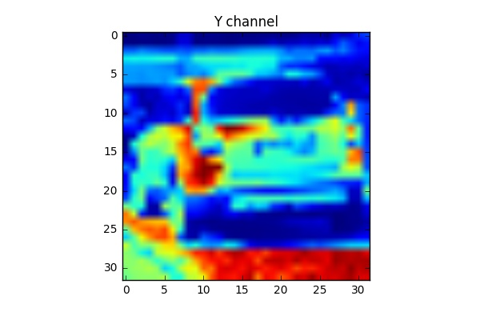
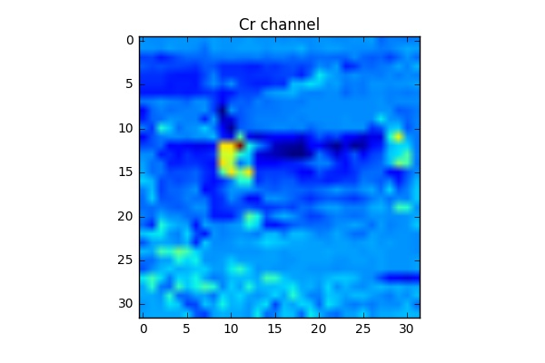
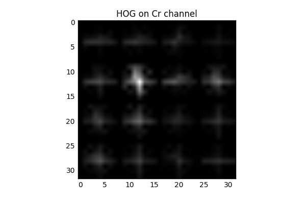
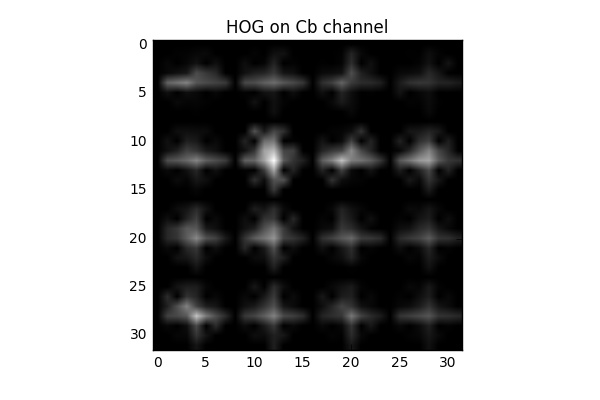
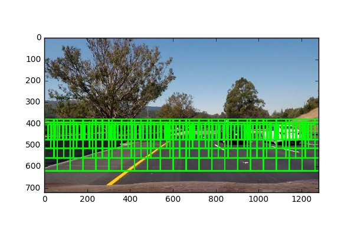
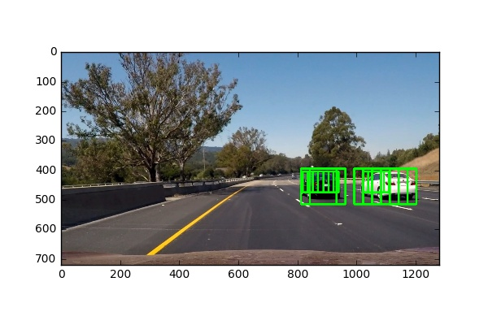
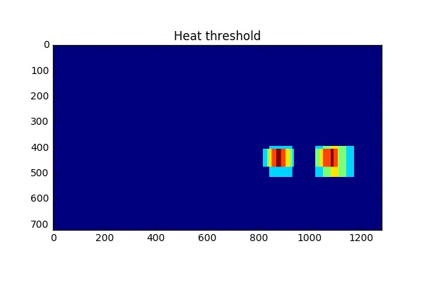
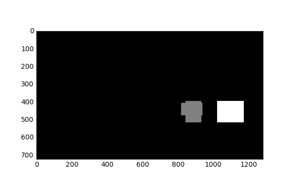
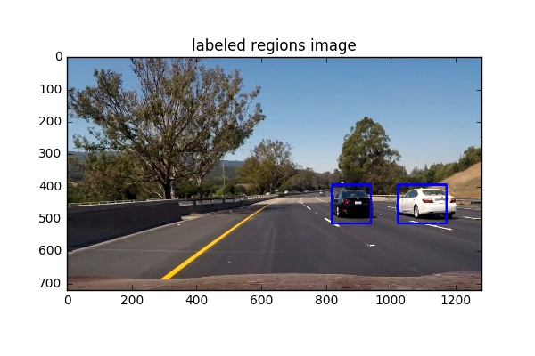

# Vehicle Detection Project (SDC ND Project 5)

## Introduction
In this project, our main goal is to write a software pipeline to detect vehicles in a video recorded from a camera fixed on the front of a vehicle by using a Support Vector Machine Classifier for prediction and applying computer vision techniques, such as Histogram of Oriented Gradients (HOG) and other features combined with sliding windows to track vehicles in in the video.

### Project code is in the the IPython notebook [vehicle_detection.ipynb](vehicle_detection.ipynb)

The goals / steps of this project are the following:

* Perform a Histogram of Oriented Gradients (HOG) feature extraction on a labeled training set of images and train a classifier Linear SVM classifier
* Optionally, you can also apply a color transform and append binned color features, as well as histograms of color, to your HOG feature vector. 
* Note: for those first two steps don't forget to normalize your features and randomize a selection for training and testing.
* Implement a sliding-window technique and use your trained classifier to search for vehicles in images.
* Run your pipeline on a video stream (start with the test_video.mp4 and later implement on full project_video.mp4) and create a heat map of recurring detections frame by frame to reject outliers and follow detected vehicles.
* Estimate a bounding box for vehicles detected.

## Data Exploration

I started by reading in all the vehicle and non-vehicle images dataset provided by Udacity which comes in two separate datasets: images containing vehicle and images not containing vehicles. The dataset contains 17,760 color RGB images 64×64 px each, with 8,792 samples labeled as containing vehicles and 8,968 samples labeled as non-vehicles.

Here is an example of one of each of the vehicle and non-vehicle classes:

#### Random sample labeled as containing vehicle:

#### Random sample labeled as containing non-vehicle:

## Feature extraction

I then explored different features: color spaces and different skimage.hog() parameters (orientations, pixels_per_cell and cells_per_block). I settled on a combination of HOG (Histogram of Oriented Gradients), spatial information and color channel histograms, all using YCbCr color space. Initially I used only the Y channel but I found that it was not enough so I used all 3 colour channels

#### As a feature vector I used a combination of:

### 1 - Spatial features, which are nothing else but a down sampled copy of the image patch to be checked itself (32x32 pixels).

#### Example of data image:

#### Example of data image applying Spatial binning

### 2- Color histogram features using individual color channel histogram information (YCbCr color space), breaking it into 32 bins within (0, 256) range.

#### Example image

#### YCbCr color space histogram

### 3- Histogram of oriented gradients (HOG) features, that capture the gradient structure of each image channel and work well under different lighting conditions.

I explored different parameters: `orientations`, `pixels_per_cell` and `cells_per_block`. eventually I settled on HOG with 10 orientations, 8 pixels per cell, 2 cells per block and 'YCrCb' color_space. The experiments went as training the classifier and checking the accurcy. 

Here is an example using the `YCrCb` color space and HOG parameters of `orientations=10`, `pixels_per_cell=(8, 8)` and `cells_per_block=(2, 2)`:

#### Example of data image:

#### Y channel:

#### HOG on Y channel:

#### Cr channel:

#### HOG on Cr channel:

#### Cb channel:

#### HOG on Cb channel:

## Training a linear support vector machine classifier
A linear SVM offered the best compromise between speed and accuracy, outperforming nonlinear SVMs (rbf kernel). I trained a Linear SVC (sklearn implementation), used sklearn `train_test_split` to split the dataset into training and validation sets and used sklearn `StandardScaler` for feature scaling.

## Sliding Window Search

The image is scanned using a sliding window. For every window the feature vector is computed and fed into the classifier.
As the cars appear at different distances, it is also necessary to search at several window scales, so the larger windows closer to the driver and the smaller closer to the horizon. The more boxes for a sliding window, the more calculations per video image.

#### Example of video frame image:

#### All search windows:

#### Detected windows:

## Video Implementation

For filtering out the false positives and combining overlapping bounding boxes:

As there are multiple detections on different scales and overlapping windows, we need to merge nearby detections. In order to do that we calculate a heatmap of intersecting regions that were classified as containing vehicles. Only considering those parts of the image as positives where more than 20 detections had been recorded. The result is a heatmap with significantly reduced noise, as shown below:

#### Detected windows:

#### Heatmap:

Then using `label()` function from `scipy.ndimage.measurements` module to detect individual groups of detections, and calculate a bounding rect for each of them.

I always kept track of the detected windows of the last 20 frames to accumulate detections instead of classifying each frame individually.

Here's a [link to my video result](output_project_video.mp4)

## Discussion

Considering the implemented pipeline I have the following thoughts:

1- The most challenging part in the project was to choose the best features to differentiate between cars and not car detection.

2- Increasing the number of search windows makes the pipeline is very slow to process, also needs to find a better way to detect the exact size of the vehicle.

3- Other types of vehicles (except cars) and pedestrians would not be detected because they are not in the training data.

4-  The pipeline likely to fail if the vehicle positions are different from those classifier was trained on.

5- I think this way of detecting vehicles is very slow to be used in a real time application without major improvement and optimisations.

## Resources
1- https://www.youtube.com/watch?v=7S5qXET179I

2- http://lear.inrialpes.fr/people/triggs/pubs/Dalal-cvpr05.pdf

3- http://scikit-image.org/docs/dev/api/skimage.feature.html?highlight=feature%20hog#skimage.feature.hog

4- http://scikit-image.org/docs/dev/auto_examples/features_detection/plot_hog.html

5- http://scikit-learn.org/stable/modules/generated/sklearn.preprocessing.StandardScaler.html

6- https://medium.com/towards-data-science/vehicle-detection-and-tracking-6665d6e1089b#.d2esacych

7- http://navoshta.com/detecting-road-features/

8- https://medium.com/@ksakmann/vehicle-detection-and-tracking-using-hog-features-svm-vs-yolo-73e1ccb35866#.k1rotod7d
